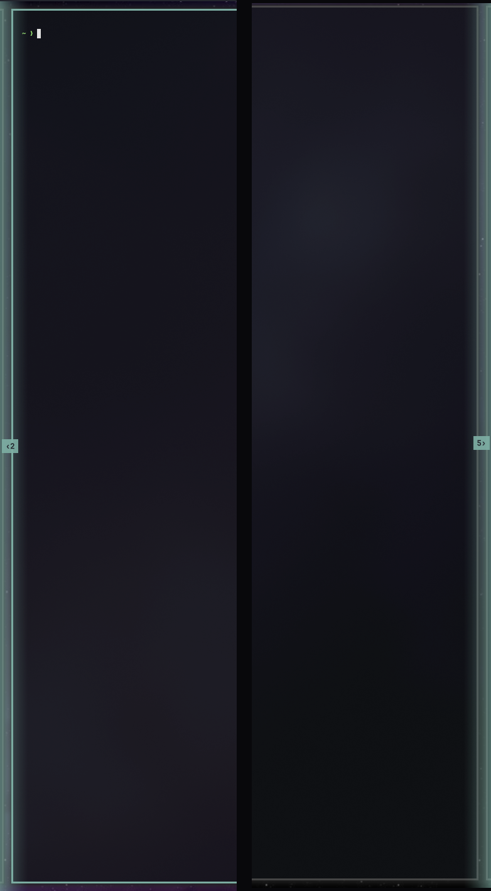

# Scroll edges

An [Omarchy](https://omarchy.org) shell plugin for the scrolling layout: when a
workspace has windows parked past the side of the screen, the edge they went
past lights up in your theme's accent colour and a small pill says how many.

The scrolling layout keeps a workspace's windows in one long row and shows the
slice that fits. Whether anything is out there is normally only legible as a
few pixels of window peeking in at the edge — on an ultrawide, easy to miss
entirely. This replaces that sliver with something you can see without looking
for it.



## Install

```sh
omarchy plugin add https://github.com/nodrej/omarchy-scroll-edges.git --enable
```

It runs as a service, so there is nothing to place in the bar.

## Usage

Nothing to press. Scroll the row as usual and the indicators follow:

- **One indicator per edge, per monitor.** A glow bleeding inward from the
  edge, and a pill with an arrow pointing the way the windows went: `‹3` on the
  left, `4›` on the right. Rotated monitors scroll top to bottom and get `⌃3`
  and `4⌄` instead; each axis is judged on its own, so nothing special is
  needed for them.
- **Only the active workspace of each monitor**, counted from Hyprland's own
  view of where the windows are, so a monitor showing everything shows nothing.
- **Windows, not columns.** Two windows stacked in one off-screen column count
  as two.
- **Floating windows are ignored** — one dragged half off-screen says nothing
  about how many columns the row holds — and a fullscreen or maximized window
  stands the indicators down, since it covers the row they annotate.
- The indicators are click-through, sit under fullscreen windows, and stay
  inside the bar's reserved area, so the glow stops at the bar instead of
  tinting it.
- Colours come from the active Omarchy theme's accent and change with it.

## Configure

Every tunable has a default that works; override the ones you want from this
plugin's entry in `~/.config/omarchy/shell.json`. Changes apply as soon as you
save — no restart.

```json
{
  "plugins": [
    {
      "id": "io.github.nodrej.scroll-edges",
      "peek": 56,
      "glowSize": 44,
      "glowOpacity": 0.62
    }
  ]
}
```

| Key | Default | What it does |
| --- | --- | --- |
| `peek` | `56` | How many pixels of a window may still be on screen before it counts as hidden. A window showing more than this is visible enough to speak for itself. |
| `glowSize` | `44` | How far the glow reaches in from the edge, in pixels. Sized for an ultrawide; a laptop screen will want less. |
| `glowOpacity` | `0.62` | How strong the glow is at the edge itself, from `0` to `1`. It fades to nothing across `glowSize`. |

A value that is missing, negative, or not a number leaves the default standing.

## Remove

```sh
omarchy plugin remove io.github.nodrej.scroll-edges
```

Removing the plugin takes its indicators with it. If you added any of the keys
above to `~/.config/omarchy/shell.json`, delete that plugin entry too; nothing
else in your configuration is touched, and the plugin never writes to it.

## Requirements and dependencies

- Omarchy 4 (Quattro), whose Quickshell-based `omarchy-shell` provides the
  `qs.Commons` and `qs.Ui` modules this plugin draws with, and the
  `Quickshell.Hyprland` models it reads the window layout from.

That is the whole dependency list. The plugin starts no processes at all — not
even `hyprctl` — downloads nothing, installs nothing, writes no files, opens no
network connections, and requests no elevated privileges. The only file it
reads is `~/.config/omarchy/shell.json`, for the settings above, and it never
writes to it.

It is built for the scrolling layout (`layout = "scrolling"` in
`~/.config/hypr/looknfeel.lua`). On the default dwindle layout it is harmless —
nothing is ever parked past an edge, so nothing ever shows.

## How it works

`ScrollEdges.qml` counts from Quickshell's own `Hyprland.toplevels` and
`Hyprland.monitors` models, reading both in one pass so a window's new position
is never measured against an old monitor size. Hyprland's event socket drives
the refreshes — almost anything can move a column across an edge, so every
event schedules the same cheap debounced re-read rather than a list of
interesting events that would quietly go stale. The refreshed data lands object
by object, and those objects say when there is something new to count, so no
delay has to be guessed at. A short safety poll covers a view that settles into
its final position without a further event to say so, and it only runs in the
ten seconds after an event, so an idle desktop is genuinely idle.

The window-counting rules live in `ScrollEdgesModel.js` as plain functions,
away from the layer-shell plumbing, so they can be read and corrected on their
own.

## License

MIT. See [LICENSE](LICENSE).
